🧾 Mini Account Management System
A beginner-friendly, role-based accounting web application built using ASP.NET Core Razor Pages, Entity Framework Core, and Identity Framework.

It allows Admins, Accountants, and Viewers to manage users and financial vouchers with role-specific access. The system supports exporting data to Excel and PDF as optional bonus features.

📦 Tech Stack
The Mini Account Management System is built using modern, scalable technologies that support clean architecture, role-based security, and robust data handling.
| Technology                      | Description                                                                                         |
| ------------------------------- | --------------------------------------------------------------------------------------------------- |
| ⚙️ **ASP.NET Core Razor Pages** | The core web framework used to build fast, scalable, and maintainable web UIs.                      |
| 🧮 **Entity Framework Core**    | ORM (Object-Relational Mapper) used for database access via C# models.                              |
| 🔐 **ASP.NET Identity**         | Manages authentication and role-based authorization for Admin, Accountant, and Viewer users.        |
| 🗄️ **SQL Server**              | The primary database engine used to store users, vouchers, accounts, and roles.                     |
| 🎨 **Bootstrap 5**              | Frontend styling framework that ensures responsive and mobile-friendly UI design.                   |
| 📊 **EPPlus**                   | Library used to generate and export reports in Excel format (xlsx).                                 |
| 🧾 **DinkToPdf**                | .NET wrapper for `wkhtmltopdf`, used to convert HTML voucher details to downloadable PDF documents. |

| Role           | Access Level                                                          |
| -------------- | --------------------------------------------------                    |
| **Admin**      | Full access: Manage all users, vouchers, and roles                    |
| **Accountant** | Can add/edit/delete vouchers,accountant,viewer, view reports,         |
| **Viewer**     | Read-only access to Viewer                                            |

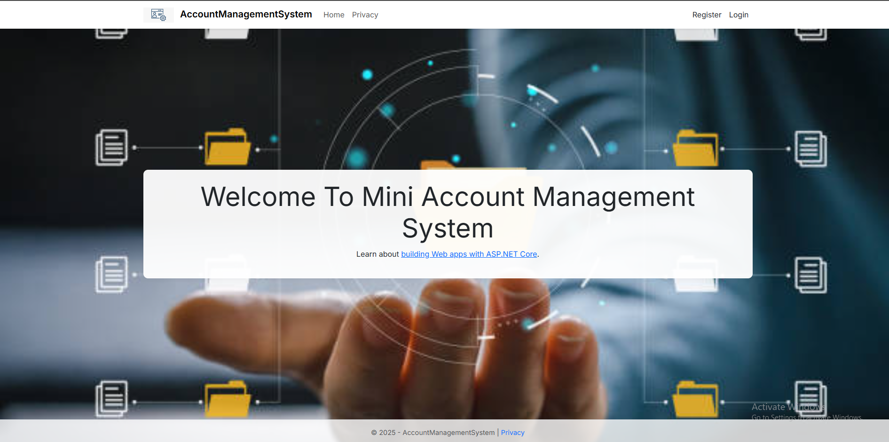
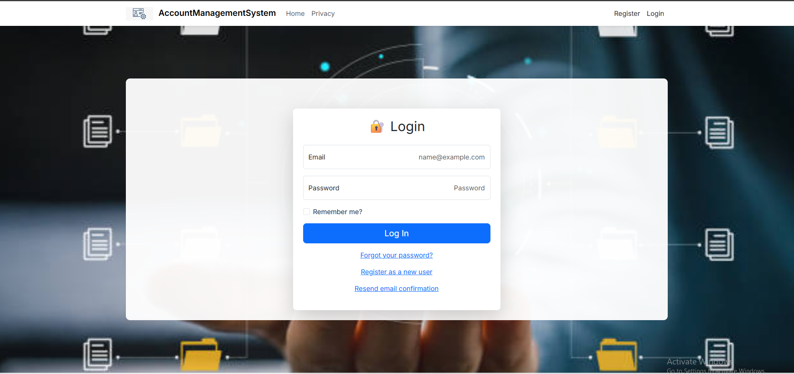
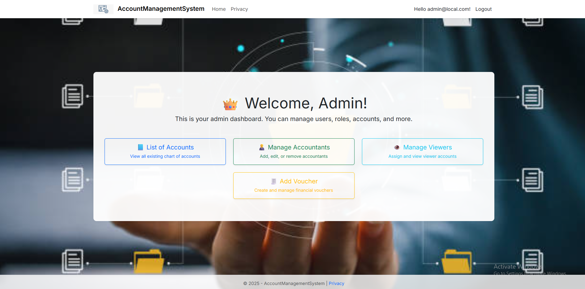
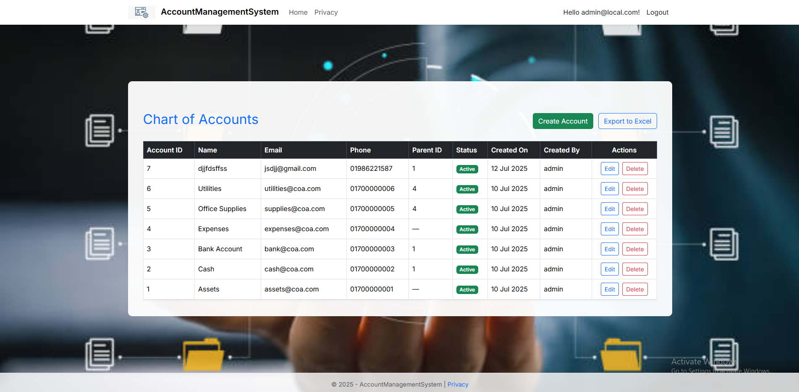
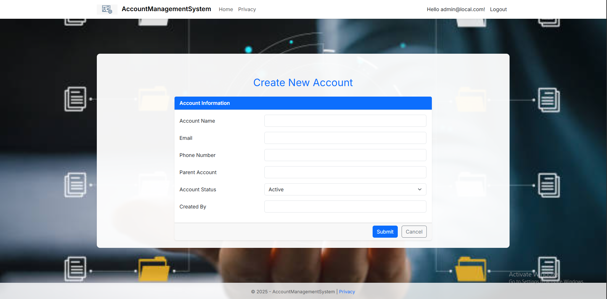
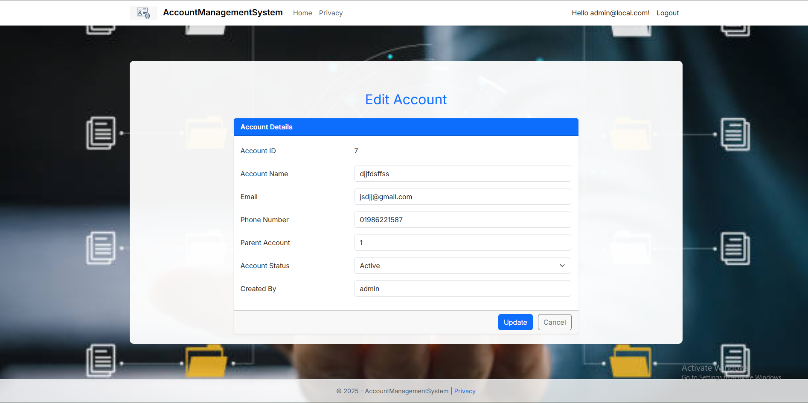
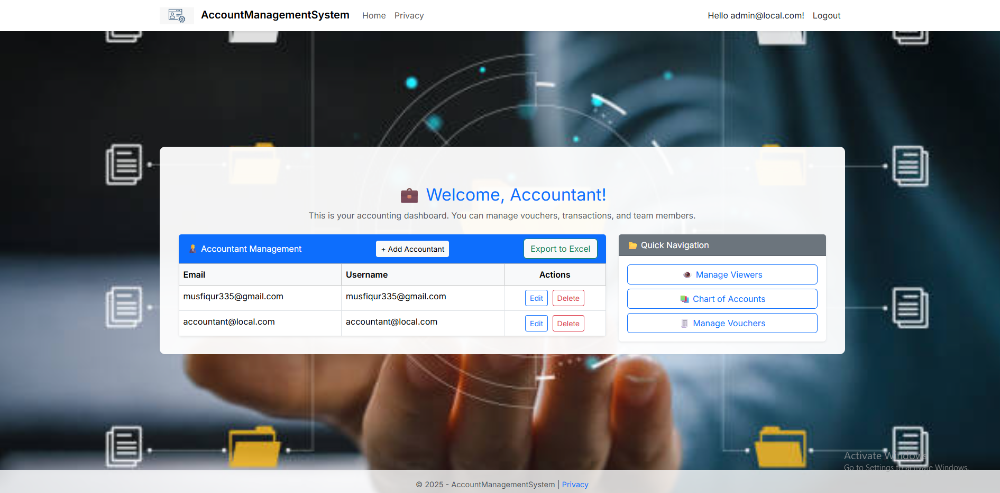
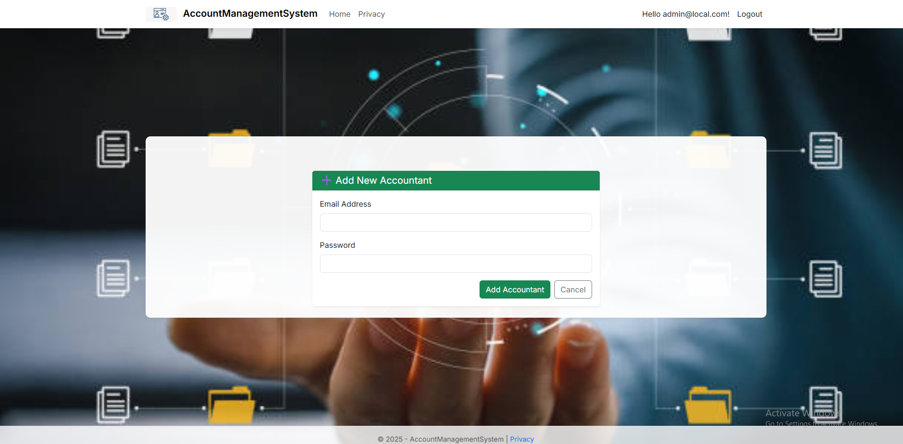
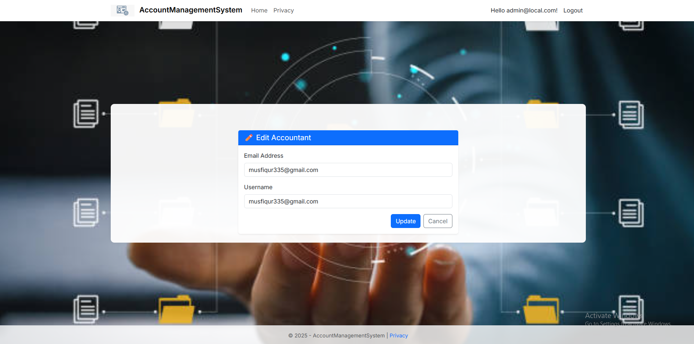
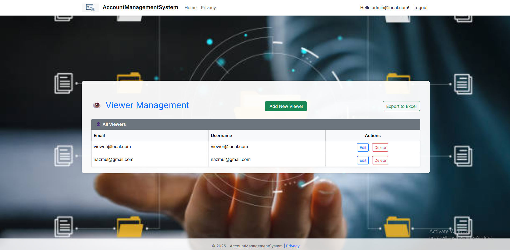
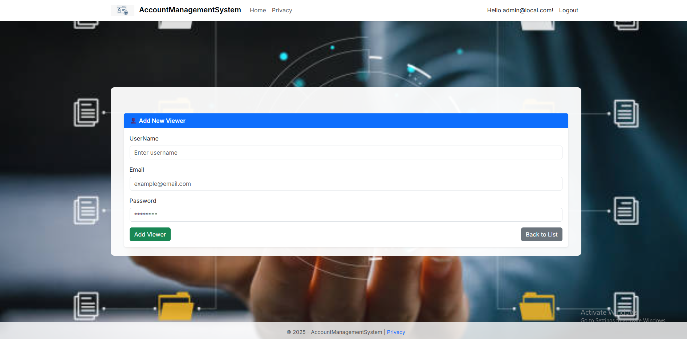
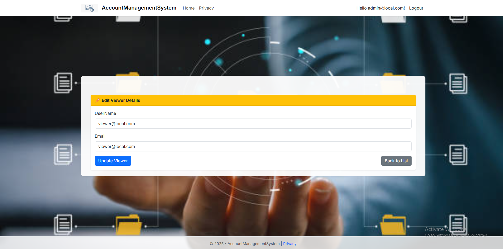
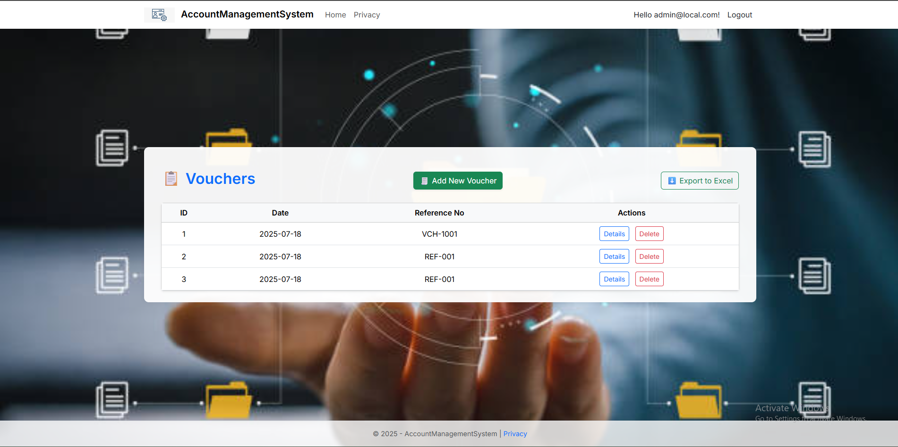

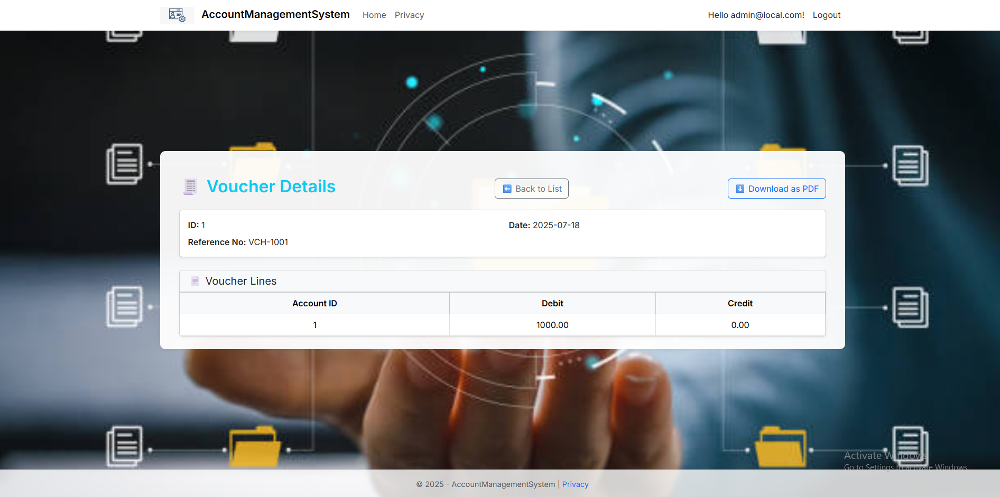

