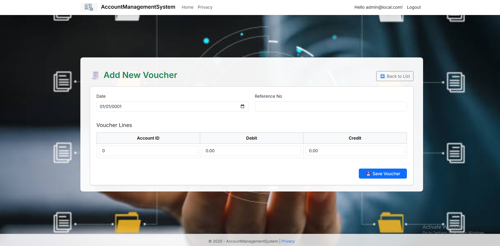

🧾 Mini Account Management System
A beginner-friendly, role-based accounting web application built using ASP.NET Core Razor Pages, Entity Framework Core, and Identity Framework.

It allows Admins, Accountants, and Viewers to manage users and financial vouchers with role-specific access. The system supports exporting data to Excel and PDF as optional bonus features.

📦 Tech Stack
The Mini Account Management System is built using modern, scalable technologies that support clean architecture, role-based security, and robust data handling.
| Technology                      | Description                                                                                         |
| ------------------------------- | --------------------------------------------------------------------------------------------------- |
| ⚙️ **ASP.NET Core Razor Pages** | The core web framework used to build fast, scalable, and maintainable web UIs.                      |
| 🧮 **Entity Framework Core**    | ORM (Object-Relational Mapper) used for database access via C# models.                              |
| 🔐 **ASP.NET Identity**         | Manages authentication and role-based authorization for Admin, Accountant, and Viewer users.        |
| 🗄️ **SQL Server**              | The primary database engine used to store users, vouchers, accounts, and roles.                     |
| 🎨 **Bootstrap 5**              | Frontend styling framework that ensures responsive and mobile-friendly UI design.                   |
| 📊 **EPPlus**                   | Library used to generate and export reports in Excel format (xlsx).                                 |
| 🧾 **DinkToPdf**                | .NET wrapper for `wkhtmltopdf`, used to convert HTML voucher details to downloadable PDF documents. |

| Role           | Access Level                                                          |
| -------------- | --------------------------------------------------                    |
| **Admin**      | Full access: Manage all users, vouchers, and roles                    |
| **Accountant** | Can add/edit/delete vouchers,accountant,viewer, view reports,         |
| **Viewer**     | Read-only access to Viewer                                            |

## Homepage 🏠

## Login Page 🔐

The login page allows users to authenticate and access the system securely.

## Admin Dashboard ⚙️

The admin dashboard provides a centralized interface for managing users, roles, accounts, and vouchers, offering tools to oversee and control the system effectively.

## List of Accounts 📋

The List of Accounts page serves as a comprehensive directory where all accounts within the system are displayed. Both admins and accountants have access to this section, allowing them to view the account list, create new accounts, and manage existing ones. Admins and accountants can update or delete accounts as needed, ensuring flexible account management. Additionally, the page offers the functionality to export the account list to an Excel sheet for easy reporting and analysis.

## Create New Account ➕

The Create New Account page allows both admins and accountants to create new accounts within the system. This page provides a user-friendly form to input account details, including name, email, phone number, parent account, status, and creator information, enabling efficient account setup.

## Edit Account ✏️

The Edit Account page enables both admins and accountants to modify and update existing account details. Users can adjust account information such as name, email, phone number, parent account, status, and creator, ensuring accurate and up-to-date records.

## Accountant Dashboard 💼

The Accountant Dashboard is the primary interface for accountants after logging in, providing a tailored workspace to manage accounting tasks. This page displays a list of accountants, allowing users to add, delete, or update accountant records. Additionally, it offers quick access options to view the list of viewers, chart of accounts, and manage vouchers. Admins have full access to this dashboard, enabling comprehensive control over all features.

## Add New Accountant 🧑‍💼

The Add New Accountant page allows both admins and accountants to create new accountant accounts. This page features a simple form where users can input the email address and password to register a new accountant, facilitating efficient team expansion within the system.

## Edit Accountant 📝

The Edit Accountant page allows both admins and accountants to modify and update existing accountant account details. Users can revise the email address and username, ensuring accurate and current information for each accountant profile.

## Viewer Management Dashboard 👥

The Viewer Management Dashboard enables admins and accountants to view the list of all viewers within the system. This page allows users to add, update, or delete viewer records as needed. Additionally, it provides an option to export the viewer list to Excel for further analysis or reporting.

## Add New Viewer 👤

The Add New Viewer page allows admins and accountants to create new viewer accounts. This page includes a form where users can enter a username, email, and password to register a new viewer, providing an easy way to expand access within the system.

## Edit Viewer 🖌️

The Edit Viewer page allows admins and accountants to modify and update existing viewer account details. Users can revise the username and email to ensure accurate and current information for each viewer profile.

## Voucher List 📜

The Voucher List page provides access for both admins and accountants to view a comprehensive list of vouchers. Users can add new vouchers, delete existing ones, and access detailed information about specific vouchers through the details option, ensuring effective voucher management.Additionally, the page includes an export to Excel feature for easy data management.

## Add New Voucher 🎟️

The Add New Voucher page allows admins and accountants to create new vouchers within the system. Users can input the date, reference number, and voucher lines, including account ID, debit, and credit amounts, to record financial transactions accurately. The page includes a save option to finalize the voucher entry.

## Add New Voucher 🎟️

## Viewer Panel👥

The Viewer Management Dashboard is the default page for viewers after logging in, providing a view-only interface. Here, viewers can see the list of viewers but are restricted from adding, updating, deleting, or exporting data, ensuring limited access to the system.

